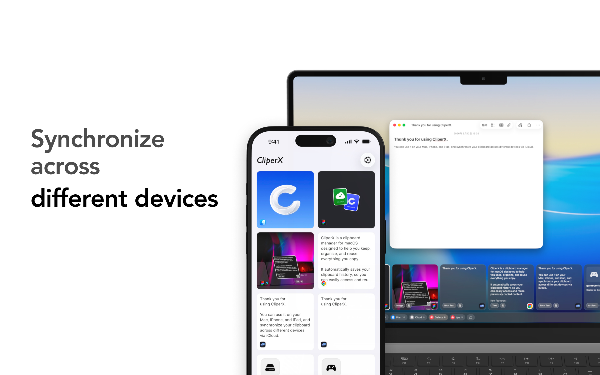
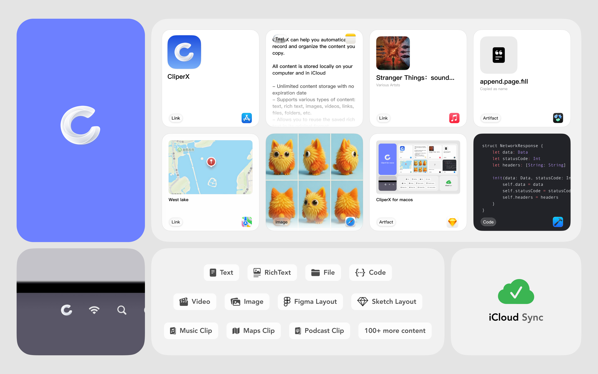
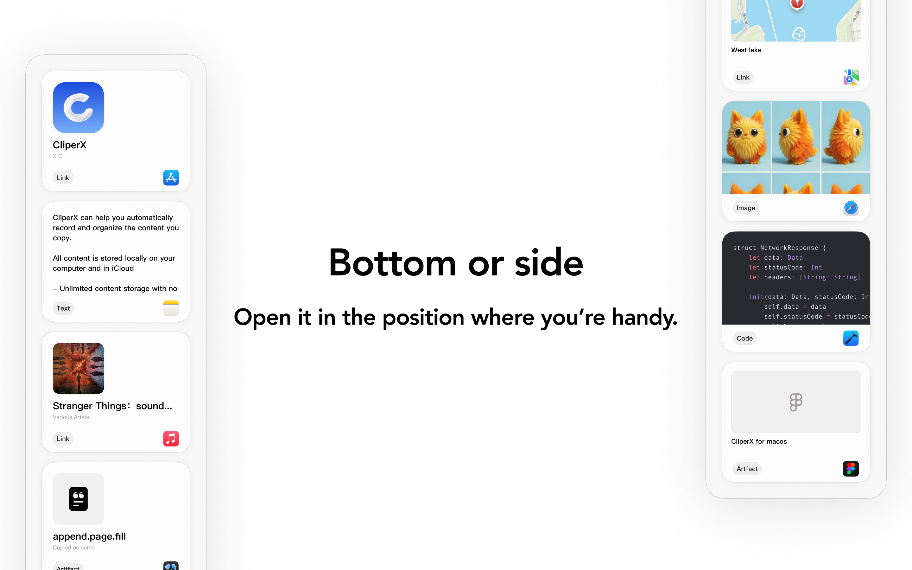
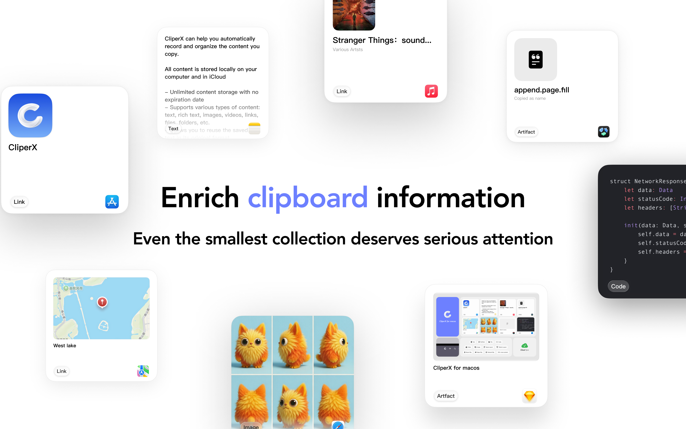
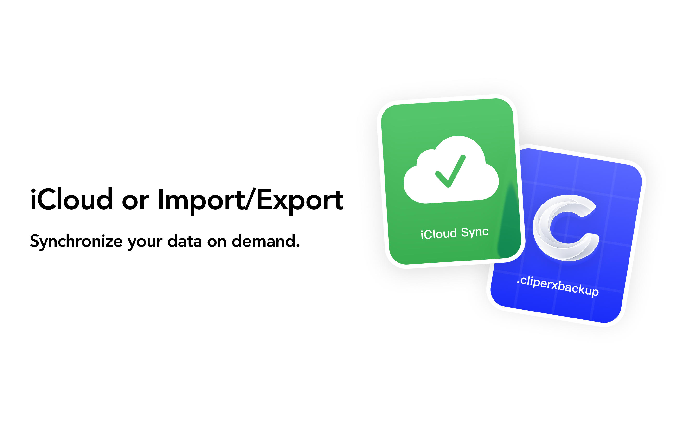

# CliperX

CliperX is a clipboard manager designed for the Apple ecosystem, helping you save, organize, and reuse important content across your devices.

It brings clipboard history, snippets, and frequently used content into one clear place, so you can quickly find what you need and use it again when it matters.

## What CliperX Does

- Keeps copied, shared, or saved content available for later use.
- Supports text, rich text, links, images, files, code, and rich previews for many everyday content types.
- Lets you search, filter, preview, favorite, mark, group, delete, and restore clipboard items.
- Uses iCloud to keep your clipboard data available across your Apple devices.
- Provides local backup export and import for migration or recovery.
- Focuses on speed, clarity, privacy, and user control.

## Platform Workflows

### Mac

- Automatically saves clipboard history while CliperX is running.
- Opens quickly from the menu bar without interrupting your workflow.
- Supports flexible panel placement, including bottom and side layouts.
- Can paste selected content into the active app when you explicitly trigger the action.
- Supports sensitive app exclusions and screen-sharing privacy controls.

### iPhone and iPad

- Helps you browse, search, copy, and reuse saved content from your synced library.
- Supports iOS-controlled save and reuse workflows, including share-sheet based saving and keyboard access where available.
- Keeps the experience user-initiated, consistent with iOS clipboard privacy protections.

## Rich Content Support

CliperX is built for more than plain text. It can keep useful context around the things you save, including app links, web links, images, files, colors, snippets, code, and other structured content.

## iCloud, Backup, and Import

- Sync clipboard data across your own Apple devices with iCloud.
- Export a local backup when you want a portable copy of your data.
- Import a backup when migrating or recovering your library.

## Privacy and Permissions

CliperX is designed to minimize data collection and keep control in your hands.

- Clipboard history is stored locally by default.
- iCloud sync uses Apple's private CloudKit database when enabled.
- Accessibility permission on Mac is used only for user-triggered paste into the active app.
- URL preview may request webpage metadata and favicon resources from target sites or favicon providers.
- iOS clipboard-related workflows stay user-initiated and do not continuously monitor typing or background clipboard activity.

Some features require iCloud to be enabled.

## Contact

Support: voderment@icloud.com

## Legal

- [Privacy Policy](CliperX%20Privacy.md)
- [Terms of Use](CliperX%20Terms%20of%20Use.md)
